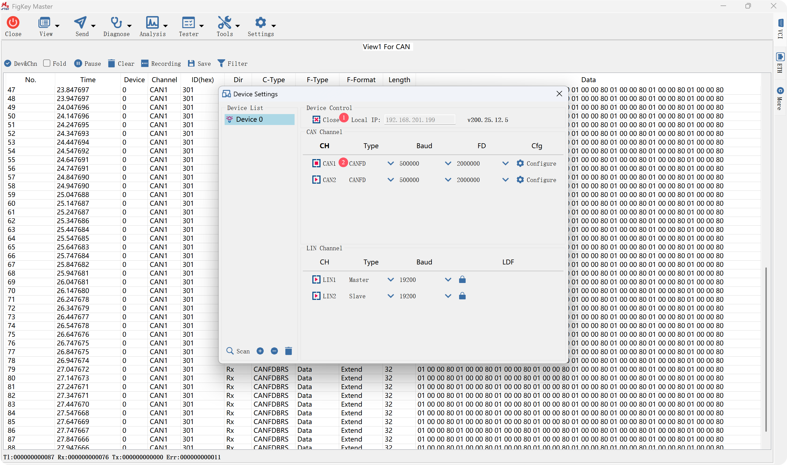
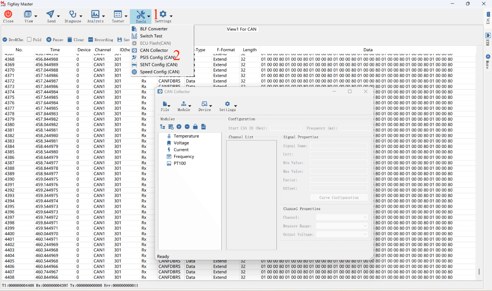
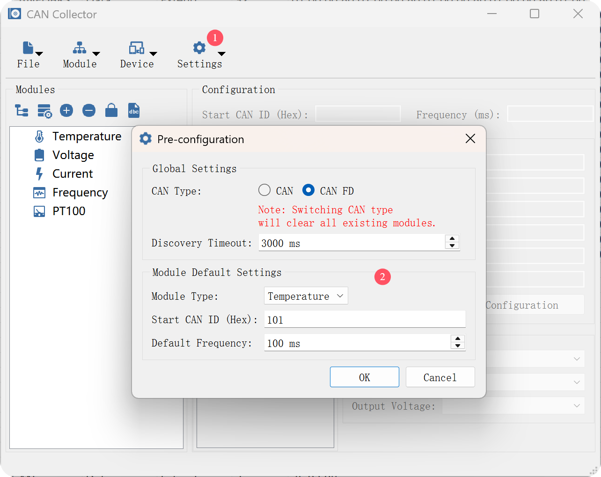
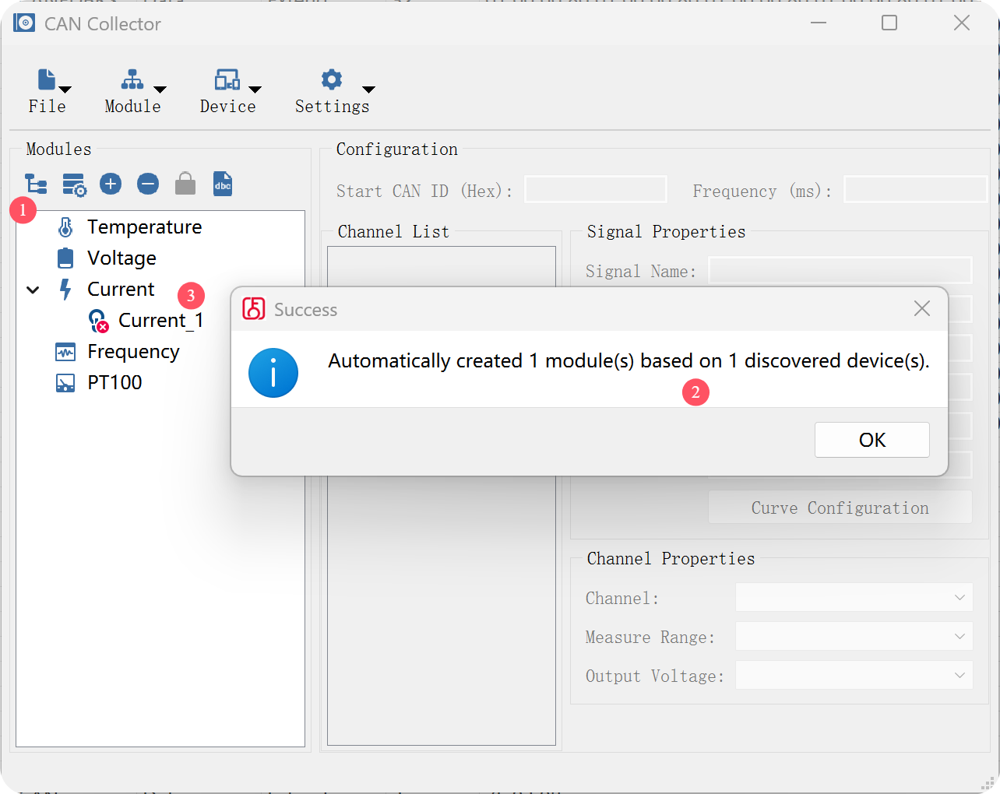
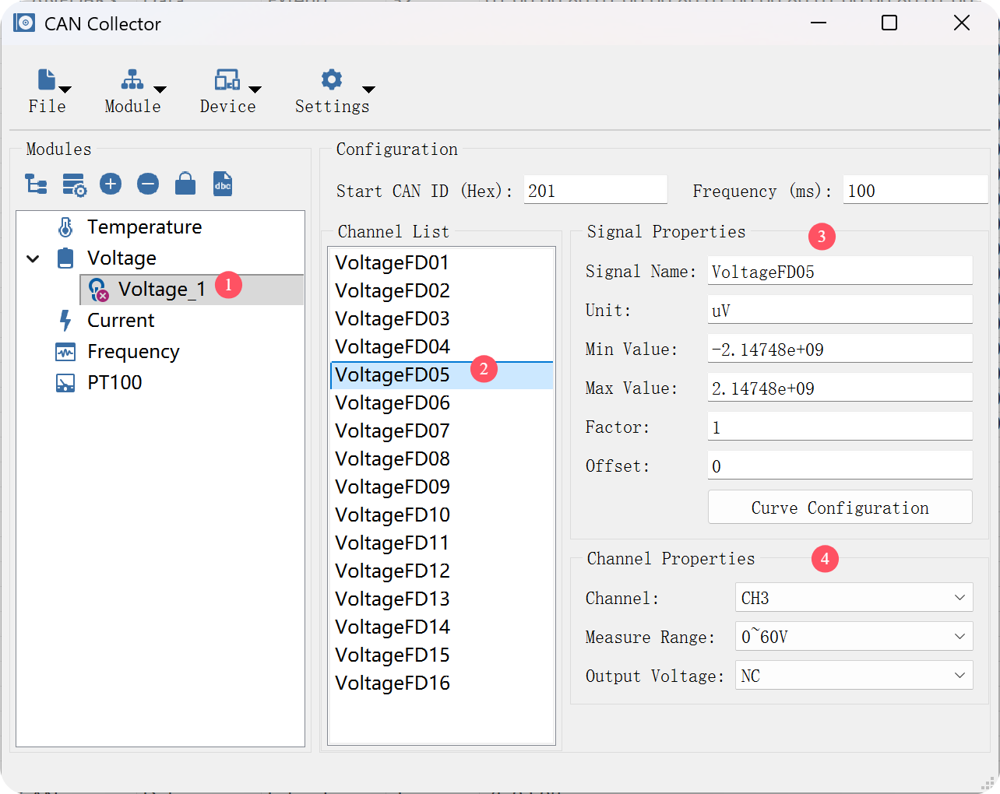
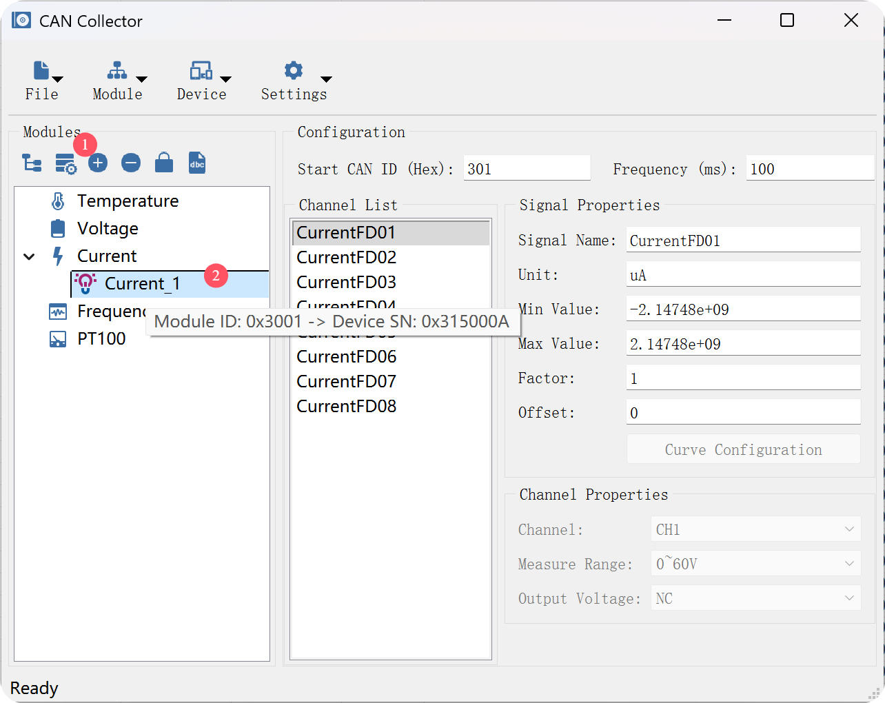
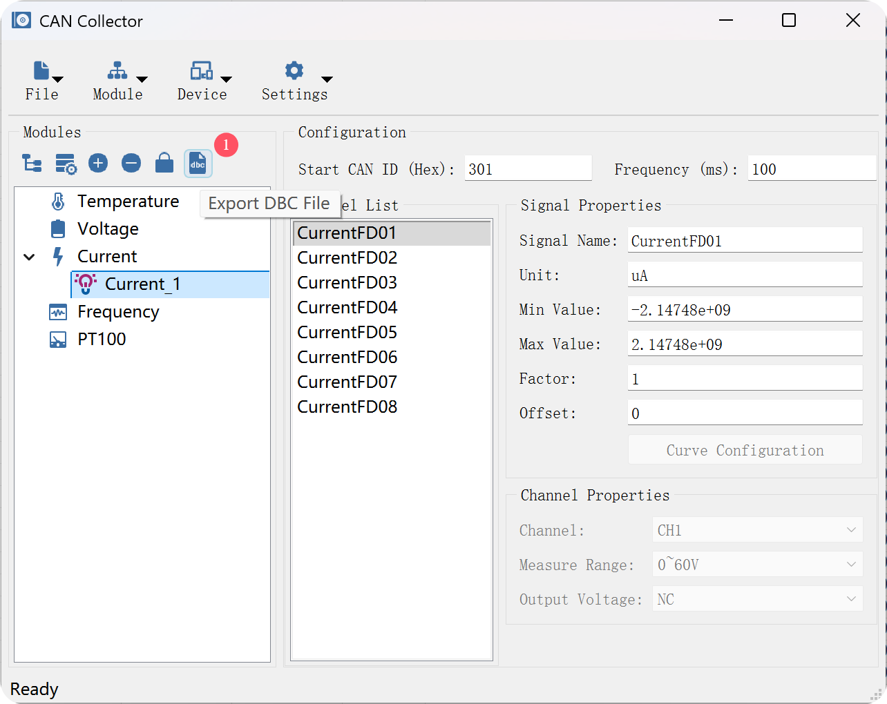
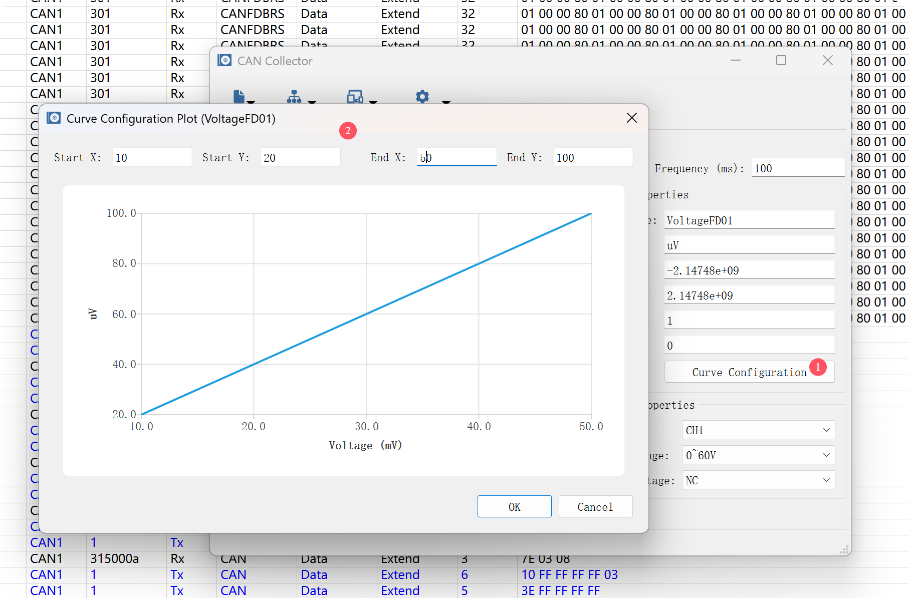

***

[TOC]

# FKMaster - CAN Collector 用户使用手册

版本：v1.0.0 | 作者：leiwei | 日期：2026-04-08

**适用软件：** FKMaster - CAN Collector工具
**涵盖模块：** 快速上手 / 高阶功能

**📌 部署提示：** 在开始使用本模块之前，强烈建议您先阅读FKMaster_x64/doc 目录下 **《FKVCI卡快速入门指南.pdf》**文档，以确保硬件驱动已正确安装、运行环境部署完毕，并且 VCI 设备能够被电脑网络正常识别与通讯。

**CAN Collector** 是 FKMaster 提供的一款专业的数据采集卡配置工具。它通过 CAN/CAN FD 网络，帮助用户快速扫描、配置和管理多种类型的采集模块，并支持将配置一键导出为标准的 DBC 数据库文件，无缝衔接后续的报文解析与波形分析工作。

**支持的采集模块类型：**
* 温度采集模块 (Temperature)
* 电压采集模块 (Voltage)
* 电流采集模块 (Current)
* 频率采集模块 (Frequency)
* PT100 采集模块 (PT100)

---

## ⚡ 1. 快速上手指南 (Quick Start)

本章节将指导您完成从设备连接到采集卡配置的完整标准流程。

### 1.1 硬件连接与通道准备

1. **打开设备与通道:** 启动 FKMaster 软件。在弹出的 `Device Settings` (设备配置) 界面中，连接您的 VCI 硬件设备，并打开与采集模块物理连接的 CAN 通道（例如 `CAN1`）。
   *(注：配置完成后，您可以关闭此对话框进入主界面)*
   

2. **进入 CAN Collector:** 在主界面顶部菜单栏，点击 **`Tools` -> `CAN Collector`**，打开采集卡配置界面。
   

### 1.2 全局参数预配置 (Pre-configuration)

在开始扫描和创建模块之前，建议先确认全局通信环境。

1. 点击工具栏的 **`Settings`** -> **`Pre-configuration`**，打开预配置窗口。
2. **Global Settings (全局设置):** 选择当前网络使用的 CAN 类型 (`CAN` 或 `CAN FD`)。
   *⚠️ 注意：切换 CAN 类型将自动清空当前界面已有的所有模块配置，请谨慎操作。*
3. **Module Default Settings (模块默认设置):** 您可以在此处为不同类型的模块预设默认的起始 CAN ID 和报文发送频率。
   

### 1.3 模块自动发现与创建 (Auto Create)

软件支持一键扫描总线上在线的物理采集卡，并自动在软件中创建对应的逻辑模块。

1. 在 CAN Collector 界面，点击左侧 `Modules` 列表上方的 **自动创建模块按钮**（工具栏第一个带树状节点的图标 ）。
2. 系统将下发扫描命令。扫描完成后，左侧列表中会自动生成对应的模块类型及实例（例如 `Current_1`）。
   

### 1.4 参数配置与信号定义 (Configuration)

在左侧树形列表中选中某个模块实例（如 `Current_1`），右侧面板将显示该模块的详细配置。

1. **基础配置:** 在顶部输入 **Start CAN ID (Hex)** (十六进制起始报文 ID) 和 **Frequency** (上报频率，单位 ms)。

2. **通道与信号配置:** 在 `Channel List` (通道列表) 中选中具体信号（如 `CurrentFD01`）。
   * **Signal Properties (信号属性):** 您可以自定义信号名称，并修改其物理换算参数（Min Value, Max Value, Factor, Offset）。
   * **Channel Properties (通道属性):** 分配该信号对应的物理通道号 (`Channel`)、测量量程 (`Measure Range`) 和输出电压 (`Output Voltage`)。电压/频率模块时，此属性可配置。
   
   

> **📌 特别说明：电压模块 (Voltage) 的特殊配置逻辑**
> 由于电压采集模块每个物理通道实际对应 2 个采集信号（即 8 个物理通道对应 16 个信号），因此在配置电压模块时：
> * **主信号（奇数编号，如 `VoltageFD01`）**：允许编辑完整的通道属性（量程、电压等）。
> * **副信号（偶数编号，如 `VoltageFD02`）**：通道属性将被禁用并自动跟随其对应的主信号配置。

### 1.5 一键物理设备绑定 (Auto Bind)

逻辑参数配置完成后，需要将其下发并绑定到真实的物理设备上。

1. 点击左侧 `Modules` 列表上方的 **自动绑定模块按钮**（工具栏第二个带配置齿轮的图标）。
2. 软件会自动将左侧的逻辑模块与总线上扫描到的相同类型的物理设备（通过 SN 码识别）进行匹配、下发配置并绑定。
3. 绑定成功后，左侧树形列表中该模块前方的**指示灯图标会点亮**。鼠标悬停在模块上，会提示当前逻辑模块 ID 绑定的真实设备 SN 码。
   

### 1.6 导出 DBC 数据库 (Export DBC)

所有模块配置并绑定完毕后，您可以将当前的配置网络导出为标准 DBC 文件。

1. 点击左侧 `Modules` 列表上方的 **DBC 导出按钮**（工具栏最右侧的 `dbc` 图标）。
2. 选择保存路径，软件会自动将所有的报文 ID、周期、信号 Factor/Offset 及通道映射关系打包生成 `.dbc` 文件。
3. 导出的 DBC 文件可直接加载到 FKMaster 的主界面DBC视图或波形分析器中，实现采集数据的完美解析。
   

---

## 🛠️ 2. 高阶功能说明

### 2.1 曲线配置 (Curve Configuration)

对于电压 (Voltage) 和频率 (Frequency) 等需要进行线性映射的采集信号，软件提供了直观的**曲线配置工具**，免去了手动计算 Factor 和 Offset 的烦恼。

1. 选中需要配置的信号，点击右侧 `Signal Properties` 面板底部的 **`Curve Configuration`** 按钮。
2. 在弹出的绘图对话框中，直接输入传感器的两点校准数据：
   * **Start X / Start Y:** 起点物理值与对应的电信号值。
   * **End X / End Y:** 终点物理值与对应的电信号值。
3. 界面会实时绘制出映射曲线。点击 `OK`，系统将自动在后台为您精确计算并填入该信号的 `Min`, `Max`, `Factor` 和 `Offset`！
   

### 2.2 手动宏观绑定与解绑管理 (Type Bind Dialog)

如果您面对的是复杂的测试台架（例如挂载了数十个同类模块），您可以通过宏观管理界面进行精准绑定。

1. 在左侧树形列表中，直接点击某个**模块类型父节点**（如 `Voltage`）。
2. 点击工具栏的**锁形图标 (Bind Device)**。
3. 弹出的管理窗口会清晰列出当前网络中所有该类型的物理设备 SN 码、通道数及其绑定状态。
4. 您可以在此界面中手动指定 SN 码与逻辑模块的对应关系，或执行批量解绑 (`Unbind All`) / 批量绑定 (`Bind All`)。

### 2.3 工作模式广播 (Start / Stop Working)

* **开始工作 (Start Working):** 点击主菜单 `Device` -> `Start Working`，系统将下发广播命令，唤醒总线上所有已配置的采集卡进入高速数据上报模式。
* **停止工作 (Stop Working):** 点击主菜单 `Device` -> `Stop Working`，系统下发广播命令，采集卡将停止数据上报，进入待机/配置模式，极大降低总线负载。

---
## 📞 技术支持

- **邮箱**: wei.lei@figkey.com
- **官网**: https://www.figkey.com

## 📄 版权声明

版权所有 © 2026 丰柯科技。保留所有权利。  
