***

[TOC]

# FKMaster - CAN 用户使用手册 

版本：v1.0.0 | 作者：leiwei | 日期：2026-02-28

**适用软件：** FKMaster 综合车载网络测试平台
**涵盖模块：** 快速上手 / 硬件配置 / 报文监控 / DBC 解析 / 报文发送 / 图形化波形分析

**📌 部署提示：** 在开始使用本模块之前，强烈建议您先阅读 **《FKVCI卡快速入门指南》**，以确保硬件驱动已正确安装、运行环境部署完毕，并且 VCI 设备能够被电脑网络正常识别与通讯。

---

## ⚡ 1. 快速上手指南 (Quick Start)
本章节将指导您在最短时间内跑通最常用的报文监控与发送流程。

### 1.1 报文监控快速上手
1. **打开软件:** 双击运行 `FKMaster.exe`。

   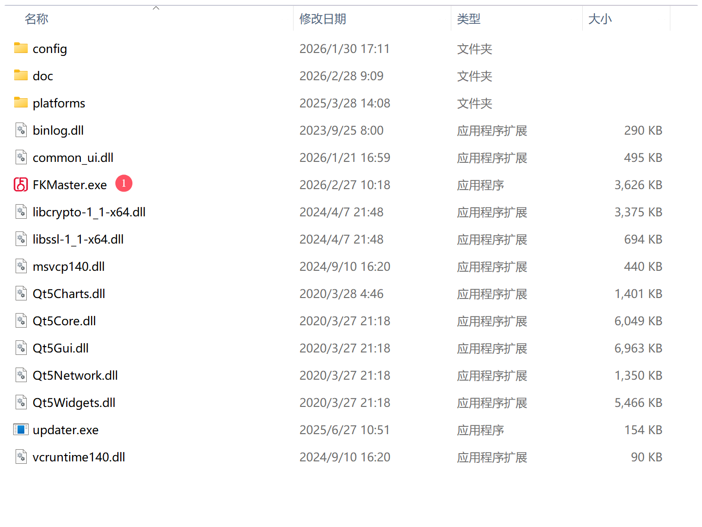

2.  **开启设备:** 软件启动后会自动弹出 `Device Settings` (设备配置) 界面（如未弹出，点击主界面菜单`Settings`或者`Settings` -> `Device Settings`）。
    
    *   **① 选择设备:** 软件默认会自动扫描设备并在左侧 `Device List` 中显示。点击选中目标设备（如 `Device 1`）。
    *   **② 开启设备:** 点击右侧顶部的 **`☑ Open`** 按钮打开设备。连接成功后，左侧设备指示灯会亮起，右侧会显示当前设备的固件版本号。
    *   **③ 启动通道:** 在下方的 CAN Channel 列表中，找到连接 ECU 的通道（如 `CAN1`），点击最左侧通道按钮 （▶CAN1）打开通道。
    
    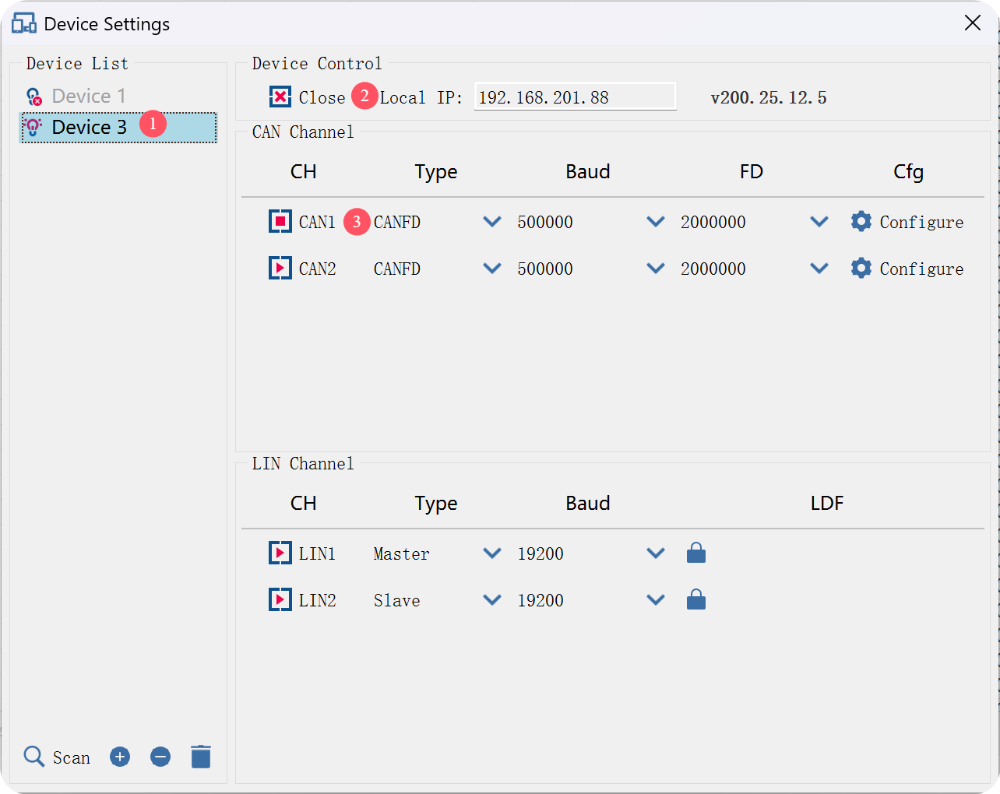
    
3. **开始监控:** 关闭配置界面，主界面默认的 **View1 For CAN** 视图中即可看到 ECU 发出的总线报文。

   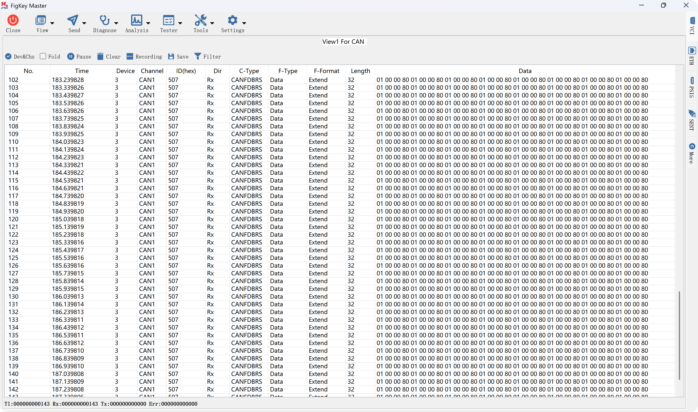

### 1.2 CAN 报文发送快速测试
*💡 提示：所有的发送界面（CAN/LIN/DBC/LDF）均具备**历史记录自动保存与加载**功能。非首次测试时，只需打开发送界面点击发送按钮即可，无需重复配置！*

1. **打开发送界面:** 点击主界面菜单 `Send` -> `CAN Send`。

2. **新增报文:** 点击界面底部工具栏图标按钮`➕`  (Add New Row)，新增一行CAN报文。

3.  **发送报文:**
    *   **单次发送:** 点击数据行中第二列的发送图标（ ▶ ）即可发送数据。
    *   **周期/顺序发送:** 勾选该行最左侧的复选框，在 `Period` 或 `Delay` 列填入时间，点击右下角的 **`Period Send`** 或 **`Sequence Send`** 即可启动自动化发送。
    
    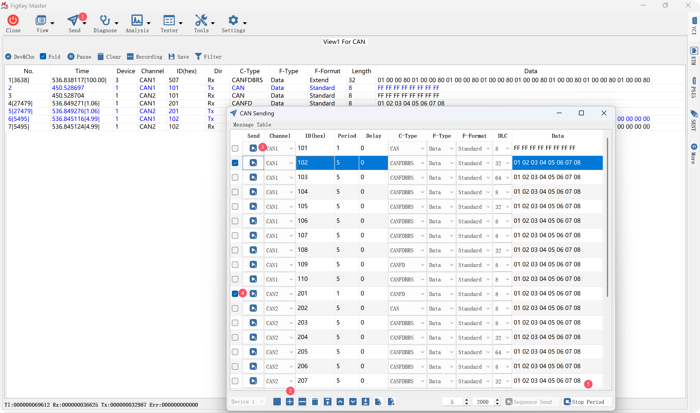

### 1.3 DBC 物理信号发送快速测试
1. **打开发送界面:** 点击 `Send` -> `DBC Send`。

2. **导入 DBC:** 点击界面底部工具栏的 **`DBC` 图标**导入 (Import DBC File)，加载您的 `.dbc` 文件（支持 UTF-8 / GB2312 等多种编码）。

3. **添加消息:** 在弹出的 `Select DBC Messages` 窗口中，可通过顶部搜索框按 **消息名称、ID 或 信号名称** 进行快速筛选。勾选目标消息（支持全选/取消全选），点击 `Confirm`。

4. **发送与修改:** 勾选列表中的消息即可参与发送。**双击消息行**，在界面下半部分的 **DBC Signal Configuration** 表格中，直接修改信号物理值（如下拉选择“闭合”），软件会自动将物理值实时打包为底层 16 进制并发送至总线！

   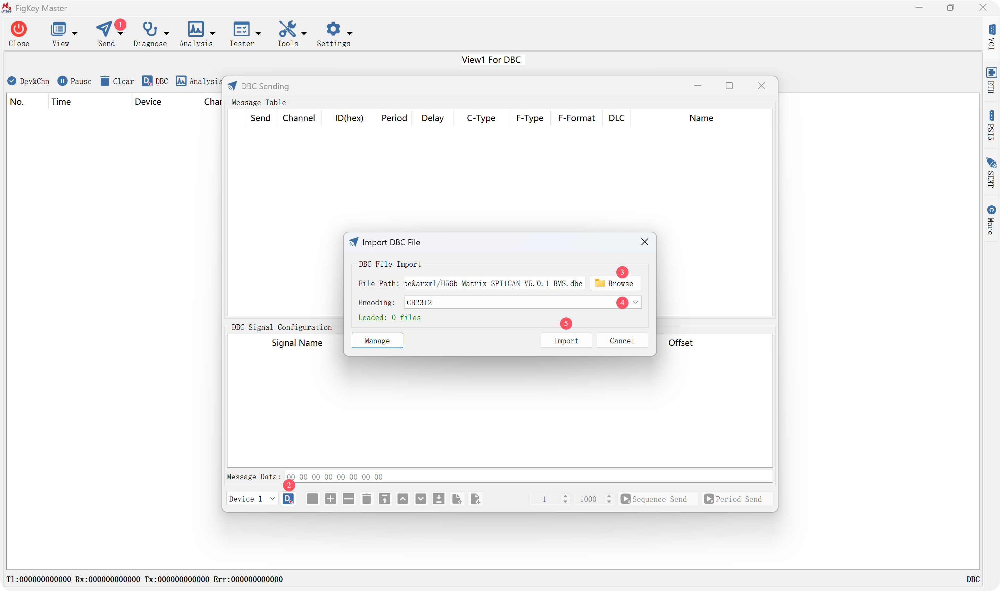

   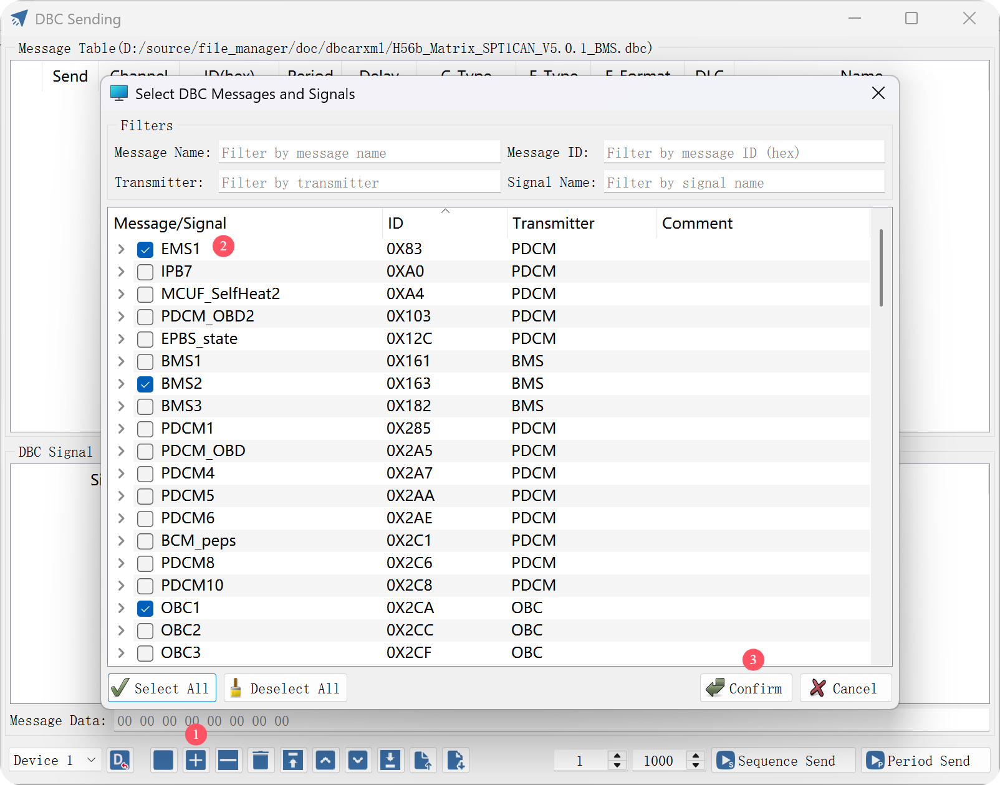

   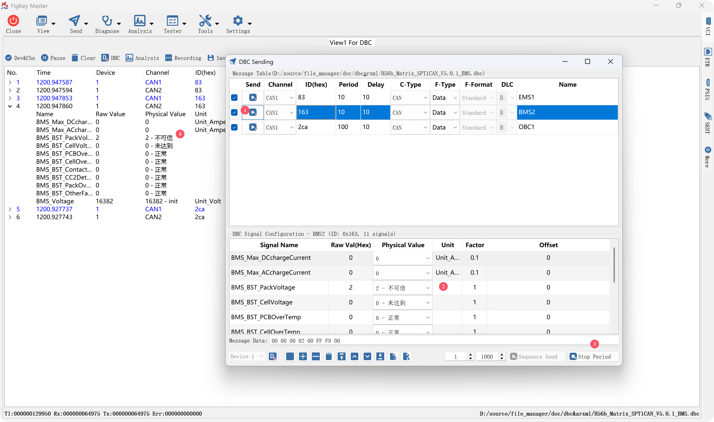

---

## 💻 2. 主界面与全局视图概览

### 2.1 主菜单与核心工具栏 (Main Toolbar)
FKMaster 采用了极具工业标准的多文档视图架构 (MDI)，顶部提供了一系列直观的核心菜单与按钮：
*   **🔌 Open/Close:** 快捷一键打开/关闭所有已配置的 VCI 硬件设备。
*   **👁️ View (视图):** 支持新建 `CAN View`、`DBC View`、`BusLoad View` (总线负载) 等。支持一键排版 (`Reset View`) 与一键关闭 (`Close View`)。
*   **🚀 Send (发送):** 建立 `CAN` / `DBC` / `LIN` / `LDF` 等报文发送任务。
*   **⚕️ Diagnose (诊断):** 包含 `UDSonCAN` 与 `OBD Diagnose` 等高级诊断功能（*具体使用方法详见独立的诊断模块说明文档*）。
*   **📈 Analysis (分析):** 唤起强大的图形化 `CAN / LIN Signal` 波形分析仪。
*   **🧰 Tools (工具) / Tester:** 提供诸如数据记录转换 (BLF Converter)、DCU 测试、ECU 刷写、电流/电压采集卡配置（CAN Collector）、PSI5 / SENT配置等高阶工具。
*   **⚙️ Settings (设置):** 进入 `Device Settings` (设备硬件配置)、时间戳显示设置及调试日志设置。

### 2.2 多窗口管理交互
* **视图排列:** 所有的 View 和发送窗口均可在主工作区自由拖拽、平铺或最大化。

* **关闭视图:** 除了在菜单栏关闭外，您也可以直接 **右键点击任意视图的标题栏**（如 "View1 For CAN"），在弹出的系统菜单中选择 `Close` 来关闭该视图。

  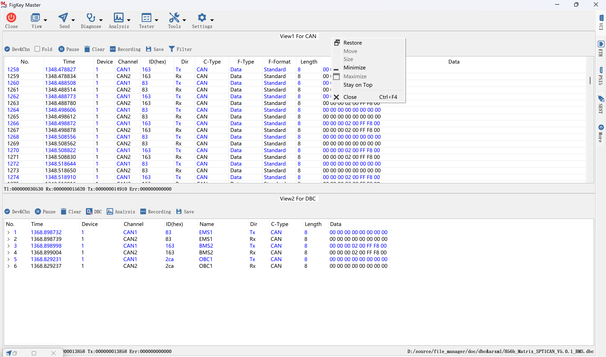

---

## ⚙️ 3. 设备与通道高级配置 (Device Settings)

### 3.1 硬件设备管理列表 (Device List)
左侧面板提供了对硬件设备的直观管理：
* **🔍 Scan:** 系统下发 UDP 广播，自动搜索网络内的 VCI 设备并列出。

* **➕ Add / ➖ Delete:** 手动添加设备，或移除列表中选中的设备。

* **🗑️ Clear:** 一键清空当前设备列表。

  注意：手动添加设备建议在未扫描到设备时使用此功能。

### 3.2 设备连接与通道参数 (Device Control)
* **多网卡连接:** 当前电脑连接了多个VCI设备时（即多个网卡连接多个设备的情况），在 `Local IP`输入框中填写当前选择的VCI设备对应的本地网卡IP，点击 **`☑ Open`** 即可连接。

  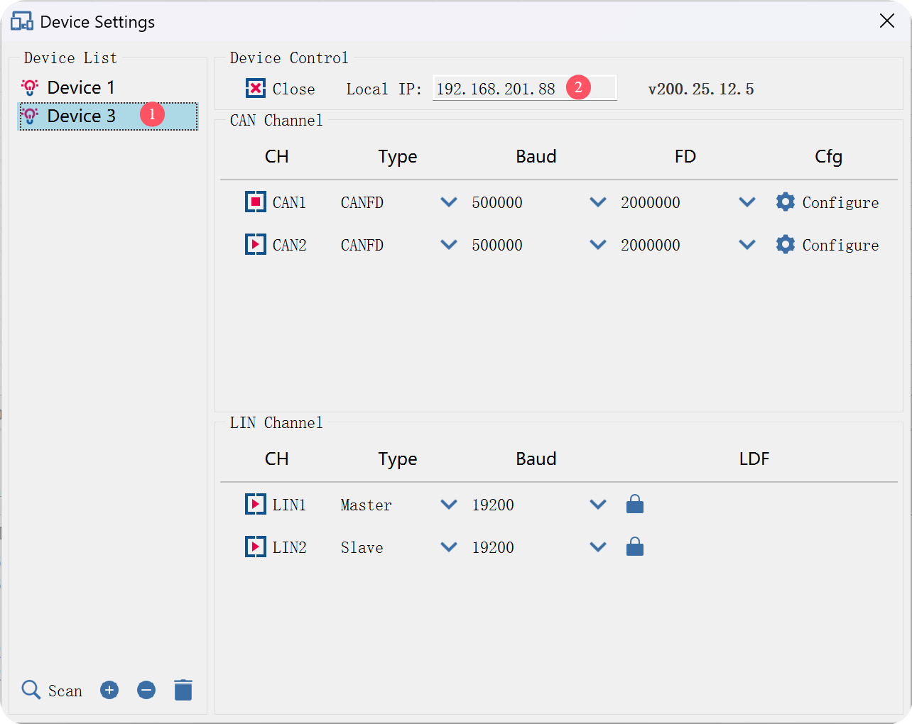

*   **CAN 通道高级配置:** 
    *   在启动通道前，可点击通道右侧的 **`⚙ Configure`** 按钮进入高级时序配置。
    *   **终端电阻:** 一键开启/关闭VCI设备内部 120Ω 匹配电阻。
    *   **时序与采样点:** 开放基于 80MHz 硬件时钟的 `Seg1 / Seg2` 配置。软件会实时计算 **Sample Point (采样点)** 并用颜色（绿/橙/红）评估质量，严格拦截无效的分频参数。
    *   配置完成后，点击通道按钮打开通道。
    
    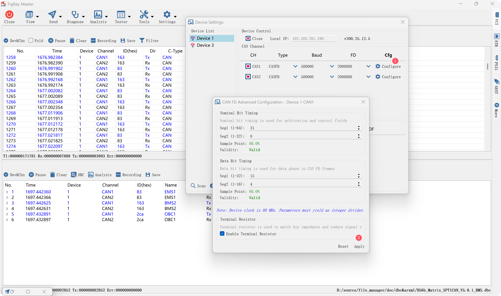

---

## 👁️ 4. CAN / DBC 报文监控视图 (View)

基于无锁队列技术，支持极高总线负载下的多通道数据融合显示，绝不卡顿。

### 4.1 核心视图控制栏 (View Toolbar)
视图顶部提供了一排高效的操作按钮：
* **Dev&Chn:** 弹出树状复选菜单，物理级屏蔽不需要关注的设备或通道。

* **Fold:** 勾选后开启智能折叠，相同 ID 的报文在同一行刷新，最右侧 `Cycle(ms)` 自动显示实时发送周期。

* **⏸ Pause / 🗑 Clear:** 随时冻结视图方便查看，或一键清空显示缓存。

* **⏺ Recording / 💾 Save:** 支持实时后台存盘，或将当前缓冲区的数据一键导出为 `.csv` / `.asc` 文件。

*   **Filter (极客过滤器):** 
    
    *   点击“**Filter**”按钮开启/关闭过滤功能。
    *   支持过滤接收(`Rx`)、发送(`Tx`)、错误帧(`Err`)。
    *   支持复合 ID 正则过滤（如单ID `123`，范围 `100-200`，多选 `100, 200`）。
    *   🔥 **反向排除:** 独创语法 `!`（如输入 `!507`），精准屏蔽干扰心跳包。
    
    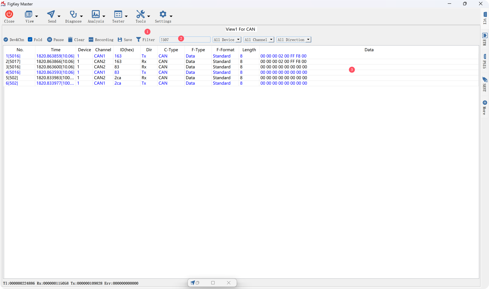

### 4.2 DBC 协议解析视图 (DBC View)
*(操作路径：View -> New DBC View)*
点击工具栏的 **`DBC` 图标**导入数据库，将 16 进制比特流解码为物理状态。

* **树状展开:** 父节点显示报文概要，展开后显示内部的 `Signals`。

* **直观展示:** 精确显示**原始值 (Raw Value)**、**物理值 (Physical Value)**（自动匹配状态枚举文本，如 `0 - 关闭`、`1 - 打开`）和 **单位 (Unit)**。

* **波形联动:** 发现数值波动异常？在目标信号上 **右键 -> Analysis**，瞬间将其送入波形示波器中。

  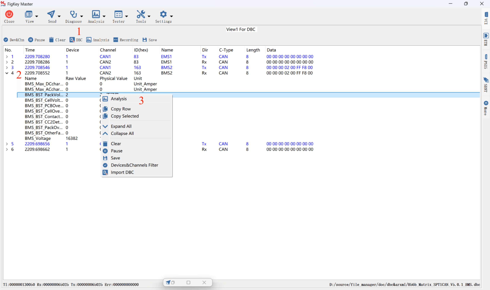

---

## 🚀 5. 报文发送与信号交互 (CAN/DBC Sending)

### 5.1 快捷任务管理栏
发送界面的左下角提供了一排快捷编辑按钮：**导入(DBC/JSON配置)、全选/反选、添加(➕)、删除(➖)、清空(🗑)、上移/下移/置顶/置底、导出配置(💾)**，极大提升了任务构建效率。

### 5.2 三大核心发送模式
1.  **单次触发 (Single Send):** 点击消息行左侧的图标按钮 **`▶` **，即刻向总线单次压入该帧。
2.  **高精度周期发送 (Period Send):** 在 `Period` 列填入周期。勾选报文后点击右下角的 **`Period Send`**。引擎启动独立高精度定时器，多条报文严格按各自周期并发。
3.  **时序顺序发送 (Sequence Send):** 
    *   利用 `Delay` 列设置当前帧发送完毕后的延时等待时间。
    *   在底部配置 **循环次数** (`0`为无限) 和 **轮次间隔 (Round Delay)**。点击 **`Sequence Send`**，系统将严格按列表自上而下串行发送，完美模拟诊断解锁 (UDS) 等握手时序。

### 5.3 DBC 信号级发送 (实时双向组包)
进入 `DBC Send` 模式时，界面切分为上下两部分：
* **物理值直接编辑:** **双击**上方选中的消息，下方会自动展示该消息的所有信号。直接下拉选择枚举状态或输入数值，系统自带安全越界拦截。

*   **友好的信息提示:**鼠标悬停消息ID时，自动显示消息相关的信息。鼠标悬停信号名称时，自动显示信号相关的信息。
    
    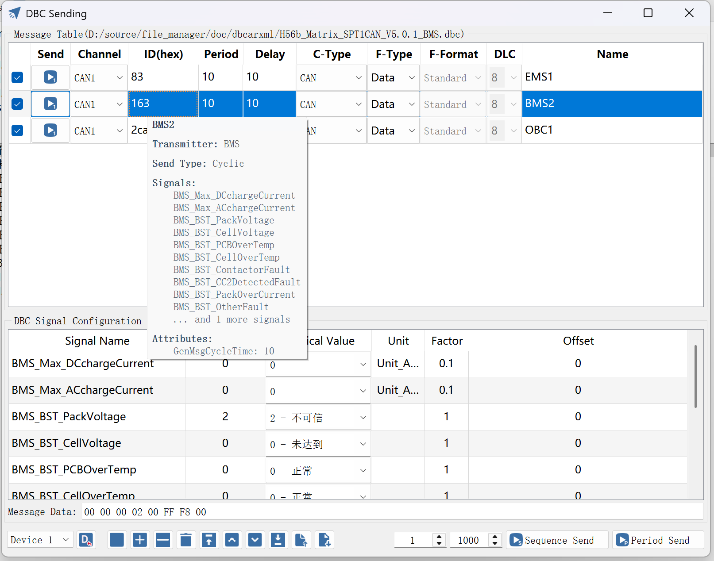
    
    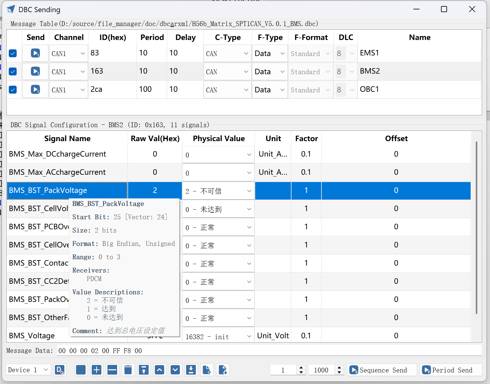
    
*   **双向实时同步:**
    
    *   **正向：** 您修改的任何物理信号，最底部的 Message Data 框会瞬间自动打包出 16 进制数据。**（注：若该报文已开启周期发送，修改将即时生效至总线上！）**。
    *   **反向：** 向 `Message Data` 框粘贴一段外部抓取的十六进制报文并回车，上方表格中所有的物理信号将瞬间反向计算并刷新！

---

## 📈 6. 图形化信号波形分析 (Signal Analysis)
*(操作路径：Analysis -> CAN Signal)*
该模块将 FKMaster 化身为一台专业的汽车总线数字示波器，基于深度定制的图表库，支持极高帧率下的多信号走势追踪。

### 6.1 核心工具栏与示波器交互
*   **➕ Add / ➖ Remove:** 呼出带搜索过滤的选择器添加关注的信号曲线，系统自动分配专属颜色。
*   **智能光标追踪 (Cursor Tracer):** 鼠标在绘图区移动时，会自动生成时间游标，并以悬浮窗（Tooltip）精准显示当前时刻的 `Time (s)` 及各信号的 `物理值 + 单位`。
*   **动态视窗控制:**
    *   **⏱️ AScroll (自动滚动):** 默认开启。X 轴跟随最新时间戳向左推进，保持最新波形在视野内。
    *   **🔍 Zoom (缩放):** 开启后禁用滚动。此时可利用鼠标滚轮对局部毛刺进行极高精度的无级放大与拖拽。
    *   **👁️ ShowY / Reset:** 自动将 Y 轴缩放至能容纳所有波形的最佳视野，或一键重置坐标系。

### 6.2 独家高级 Y 轴管理 (Y-Axis Editor)
不同的信号量级往往天差地别（如转速 5000 rpm，电压 12 V）。点击工具栏的 **`Edit`** 按钮进入 Y 轴编辑器：
* **独立轴控制:** 为每个信号独立配置颜色、可见性以及独立的 Min/Max 量程。

*   **🔥 智能自适应 (Adjust 信号):** *极其重要的功能！* 在绘图区选中某条信号曲线并**右击**，选择 **"Adjust [信号名]"**。
    
    *   应用场景： 当信号默认量程为 -10000 ~ +10000，但实际只在 -10 ~ +10 之间波动时，波形看上去会像一条死寂的直线。点击 Adjust 后，系统会自动根据近期实际数据的 Min/Max 范围附加合理容差（如缩放至 -10.1 ~ +10.1），让细微的波动瞬间铺满视图，一目了然！
    
    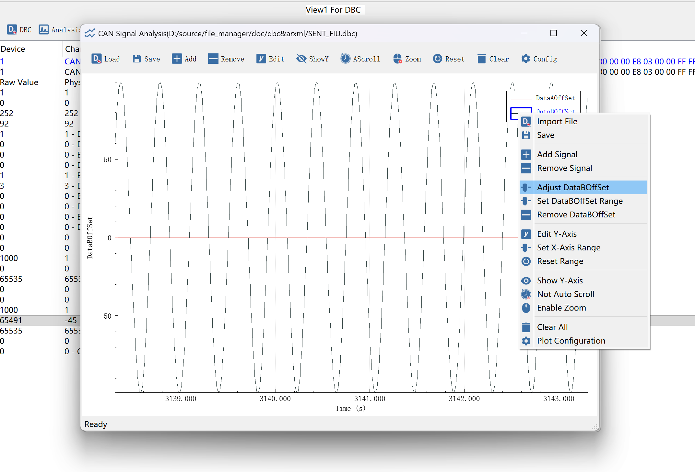
    
*   **🔥 合并 Y 轴 (Merge Axes):** 解决汽车测试痛点的杀手级功能！
    *   当需要横向对比多个同量纲信号（如监测 24 个电池单体的电压一致性）时，通过添加一个 `Merge Axis`，可将这 24 个电压信号绑定到同一个合并轴上。
    *   它们将**强制共享同一个统一的 Y 轴比例尺**。压差偏大、掉电异常，一目了然！
    
    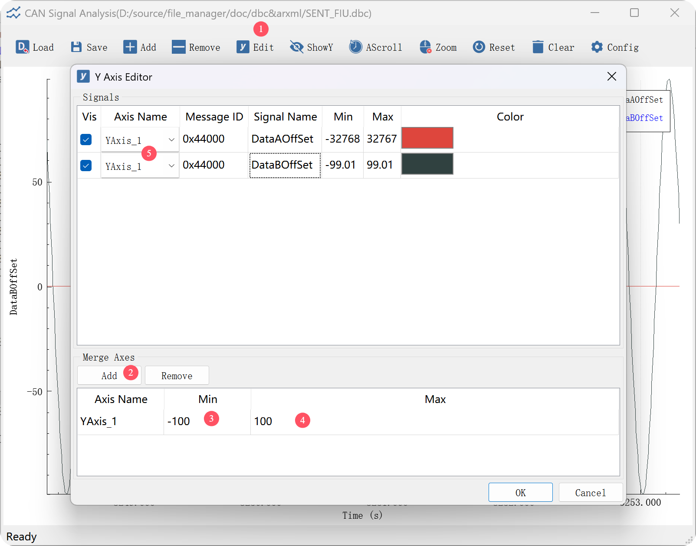
    
    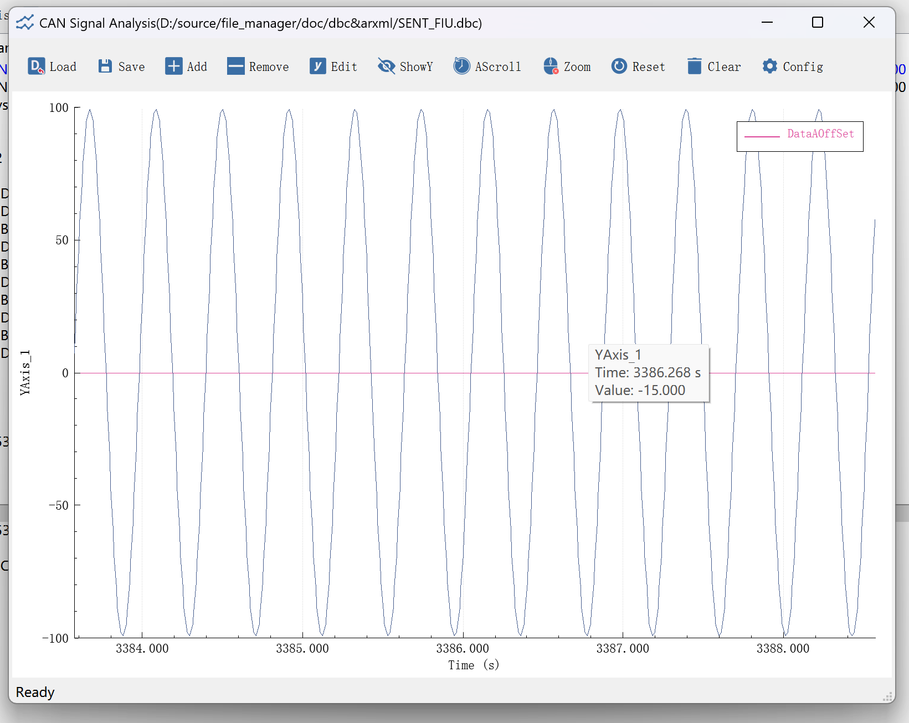

### 6.3 数据库加载与报告导出 (Load / Save)
*   **📂 Load (加载配置):** 点击 Load 按钮将导入 `.dbc` / `.ldf` 数据库文件，用于在分析器中建立起解析规则映射。
*   **💾 Save (导出数据):** 测试结束后，点击 Save 不仅支持将波形保存为高清截图，更支持将极高精度的数据点**导出为标准的 `.csv` 表格**，方便进行深度的 Excel 汇报与数据挖掘。

---
## 📞 技术支持

- **邮箱**: wei.lei@figkey.com
- **官网**: https://www.figkey.com

## 📄 版权声明

版权所有 © 2026 丰柯科技。保留所有权利。  
